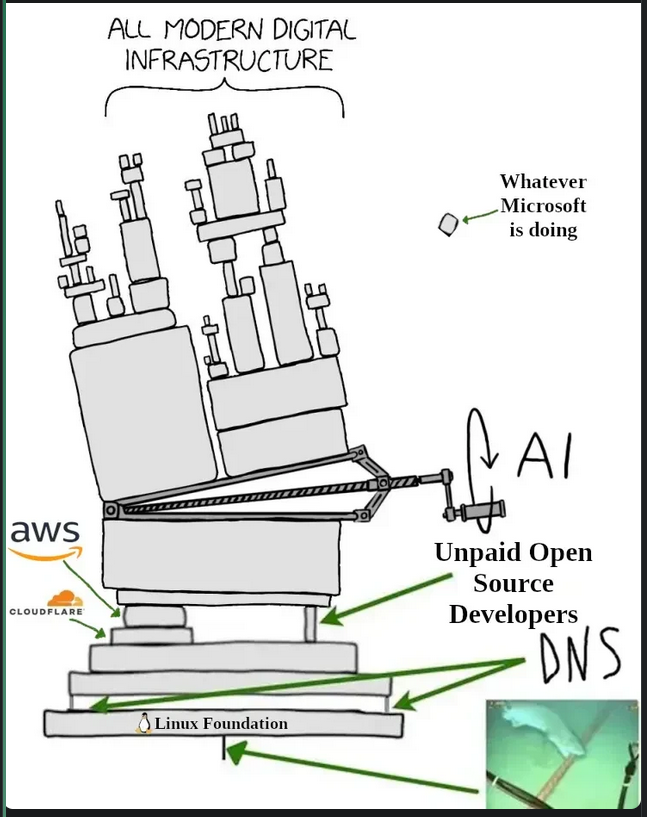

Overview
---

- Kinsa mani siya?
- What is FOSS?
- Why is open source important?
- Most important open source software
- All about GitHub Codespaces
- Making your first pull request

<!-- end_slide -->

Quick Intro
---

- Kervy Caranto
- BSCS 2
- likes languages and writing
- nakatutok nag computer pag panganak

<!-- end_slide -->

FOSS
---

- **Free and Open Source Software**
- stands in contrast with proprietary, "closed source" software
- promotes accessibility, transparency, and of course, **🦅FREEDOM🦅**

<!-- end_slide -->

Why?
---

- It democratizes knowledge and access to crucial techonologies.
- Represents the indomitable will of the human spirit.
- Libre siya.

<!-- end_slide -->

<!-- jump_to_middle -->

What Software is Open Source?
---

<!-- end_slide -->

<!-- jump_to_middle -->

Git itself
---

<!-- end_slide -->

FFMPEG
---

<!-- end_slide -->

Linux
---

<!-- end_slide -->

gikapoy nakog slides
---

- yap about Git being a lifehack
- Git anecdotes from classmates
- magstart nag "activity"

<!-- end_slide -->

# Workshop Repo

<!-- jump_to_middle -->

https://github.com/RainAfterDark/GitGud
---